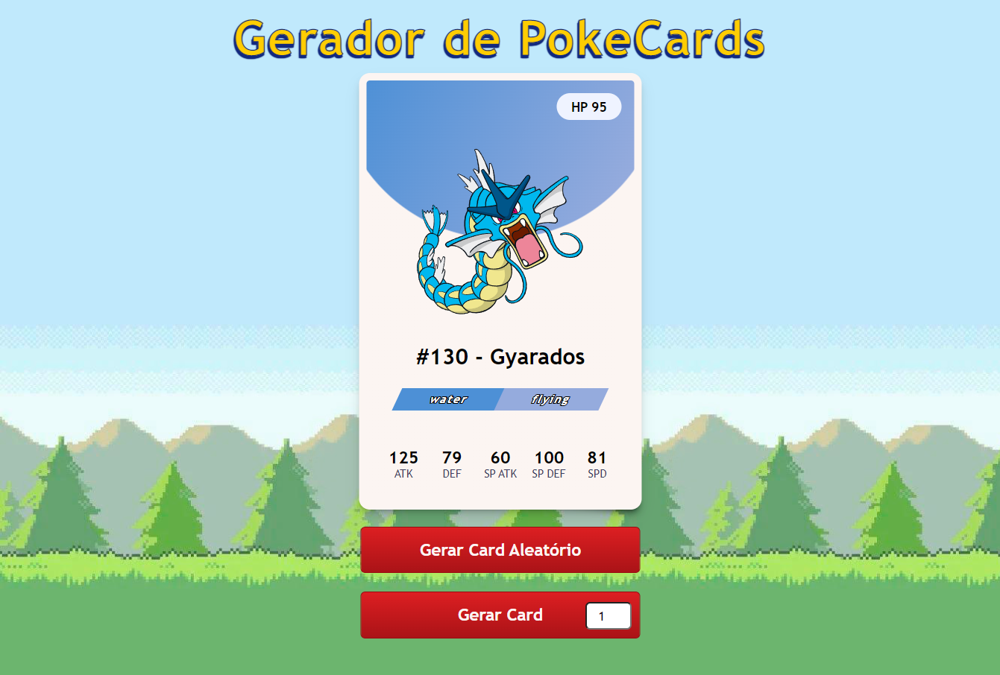

## Gerador de Pokecards
##### Esse é apenas um exercício para treinar o consumo de API utilizando o [pokeapi](https://pokeapi.co/).

>Exemplo de card gerado:
>

O botão Gerar Card Aleatório é auto explicativo.

O botão Gerar Card com um input na frente serve para gerar um card com o número do pokemon específico.

Apenas a primeira e segunda geração de pokemons é gerada, ou seja, dentre o número 1 a 251.